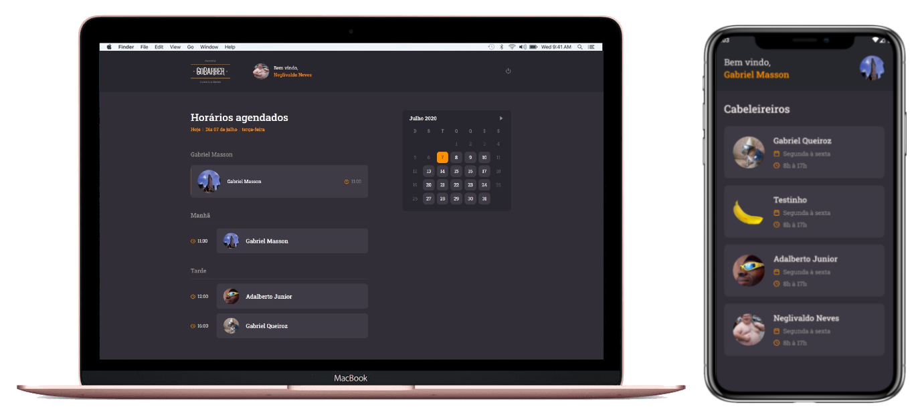

  
  <h3 align="center">GoBarber WEB & Mobile</h3>
  

   
    This project was developed to facilitate and organize the appointments of a hairdresser.
   
   
    In WEB, hairdressers <strong>can register yourself</strong> to appear in mobile app and <strong>receive notifications of new appointments</strong>, in MOBILE, a customer <strong>can view all registered hairdresses</strong>, <strong>select one</strong> and <strong>make an appointment</strong> with him.
   
   
  <h3 align="center">WEB Technologies</h3>
    - ReactJS
    - Typescript
    - Styled components
    - Unform
   
   
   
  

    
  

